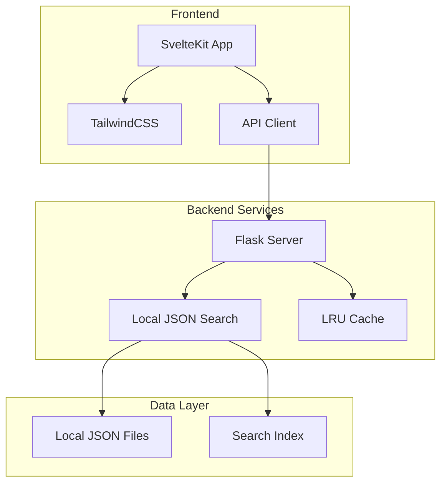

<p align="center">
  <h1 align="center">🕌 Open Hadith</h1>
  <p align="center">
    <strong>A modern, fast, offline-first hadith search engine</strong>
  </p>
  <p align="center">
    Powered by Local JSON Search with Advanced Fuzzy Matching
  </p>
  <p align="center">
    <a href="https://img.shields.io/github/license/uakbr/ask-hadith">
      
    </a>
    <a href="https://depfu.com/github/uakbr/ask-hadith?project_id=13555">
      
    </a>
    
    
  </p>
</p>

## 📚 Table of Contents

- [Overview](#-overview)
- [Architecture](#-architecture)
- [Features](#-features)
- [Tech Stack](#-tech-stack)
- [Installation](#-installation)
- [API Documentation](#-api-documentation)
- [Data Structure](#-data-structure)
- [Development Roadmap](#-development-roadmap)
- [Performance & Optimization](#-performance--optimization)
- [Contributing](#-contributing)

## 🌟 Overview

Open Hadith is a comprehensive hadith search engine that provides instant access to authentic Islamic hadith collections. The application runs completely offline using local JSON data, ensuring privacy, speed, and reliability without any external dependencies.

### Key Capabilities
- **Full-text search** across 6 major hadith collections
- **Fuzzy matching** for handling typos and variations
- **Highlighting** of search terms in results
- **100% Offline** - No database or internet required
- **LRU caching** for lightning-fast repeated searches
- **Mobile-responsive** modern UI
- **RESTful API** for programmatic access

## 🏗 Architecture



### Component Overview

#### Frontend (SvelteKit)
- **Location**: `/web`
- **Framework**: SvelteKit with TailwindCSS
- **Key Components**:
  - `SearchBox.svelte`: Main search interface with debouncing
  - `Hadith.svelte`: Result display component
  - `HadithFilters.svelte`: Advanced filtering options
  - `Nav.svelte`: Navigation and branding
- **Features**:
  - Server-side rendering (SSR)
  - Progressive enhancement
  - Responsive design
  - Real-time search as you type

#### Backend (Python Flask)
- **Location**: `/server`
- **Framework**: Flask with Flask-CORS
- **Key Module**:
  - `app.py`: Main application and routing
  - `local_search.py`: JSON-based local search engine
- **Features**:
  - Smart caching with LRU (512 entries)
  - Fuzzy text matching
  - Search result highlighting
  - CORS support for cross-origin requests

## ✨ Features

### Current Features
- ✅ **Offline-First**: Works completely without internet
- ✅ **Advanced Search**: Fuzzy matching, highlighting, scoring
- ✅ **Collection Filtering**: Search within specific hadith collections
- ✅ **Reference Lookup**: Direct hadith retrieval by reference number
- ✅ **Responsive UI**: Mobile-first design with desktop optimization
- ✅ **API Access**: RESTful endpoints for programmatic access
- ✅ **Smart Caching**: LRU cache for improved performance
- ✅ **No Dependencies**: No database or external services required

### Search Capabilities
1. **Text Search**: Full-text search across all hadith
2. **Fuzzy Matching**: Handles typos and variations
3. **Collection Search**: "bukhari prayer" searches within Bukhari
4. **Reference Search**: "bukhari 123" retrieves specific hadith
5. **Multi-word Search**: Scores based on all matching terms

## 🛠 Tech Stack

### Frontend
- **SvelteKit**: Modern framework with SSR
- **TailwindCSS**: Utility-first CSS framework
- **Vite**: Fast build tool and dev server

### Backend
- **Python 3.8+**: Main backend language
- **Flask**: Lightweight web framework
- **JSON**: Local data storage

### Infrastructure
- **Netlify**: Frontend hosting
- **Docker**: Container deployment
- **Gunicorn**: Production WSGI server

## 🚀 Installation

### Prerequisites
- Node.js 16+ and npm
- Python 3.8+

### Quick Start

#### 1. Clone the repository
```bash
git clone https://github.com/uakbr/open-hadith.git
cd open-hadith
```

#### 2. Frontend Setup
```bash
cd web
npm install
npm run dev  # Development server on http://localhost:3000
```

#### 3. Backend Setup
```bash
cd server
python3 -m venv venv
source venv/bin/activate  # On Windows: venv\Scripts\activate
pip install -r requirements.txt
export FLASK_APP=src.app  # On Windows: set FLASK_APP=src.app
flask run  # API server on http://localhost:5000
```

That's it! No database setup or configuration needed. The application works immediately with the included JSON data.

### Production Deployment

#### Frontend (Netlify)
```bash
cd web
npm run build
# Deploy /web/build to Netlify
```

#### Backend (Docker)
```bash
cd server
docker build -t open-hadith-api .
docker run -p 8000:8000 open-hadith-api
```

## 📡 API Documentation

### Search Endpoints

#### 1. Basic Search
```http
GET /api/search?search={query}
```
**Response**:
```json
[{
  "collection_id": "bukhari",
  "collection": "Sahih Bukhari",
  "hadith_no": 1,
  "book_no": 1,
  "book_en": "Revelation",
  "narrator_en": "Narrated 'Umar bin Al-Khattab",
  "body_en": "I heard Allah's Messenger saying...",
  "book_ref_no": "1",
  "score": 5.2
}]
```

#### 2. Advanced Search (v2)
```http
GET /api/v2/search?search={query}
```
**Response**: Same as above with additional `highlights` field showing matched text positions

#### 3. Get Specific Hadith
```http
GET /api/{collection}/{book}/{reference}
```
**Example**: `/api/bukhari/1/1`

### Supported Collections
- `bukhari` - Sahih Bukhari
- `muslim` - Sahih Muslim
- `abudawud` - Sunan Abu Dawud
- `tirmidhi` - Jami' at-Tirmidhi
- `nasai` - Sunan an-Nasa'i
- `ibnmajah` - Sunan Ibn Majah

## 📊 Data Structure

### JSON Data Organization
```
/data/
├── search-index.json      # Pre-built search index (8MB)
├── collections.json       # Collection metadata
└── hadiths/
    ├── bukhari/          # 40MB
    │   ├── book-1.json
    │   └── book-2.json
    ├── muslim/           # 35MB
    └── ...
```

### Hadith Document Schema
```json
{
  "hadithNumber": 1,
  "arabicText": "...",
  "englishText": "...",
  "englishNarrated": "...",
  "bookReference": "1",
  "searchableText": "..."  // Pre-processed for search
}
```

### Total Data Size
- **Search Index**: 8MB
- **All Collections**: ~150MB
- **In-Memory**: ~150MB when loaded

## 🎯 Development Roadmap

### Phase 1: Core Improvements (Current Sprint)
- [ ] **Search Enhancements**
  - [ ] Implement Arabic search support
  - [ ] Add search filters (grade, narrator)
  - [ ] Implement search history and suggestions
  - [ ] Add phonetic search for Arabic terms

- [ ] **Performance Optimization**
  - [ ] Implement partial index loading
  - [ ] Add search result pagination
  - [ ] Optimize memory usage
  - [ ] Add compression for JSON data

### Phase 2: Advanced Features
- [ ] **User Features**
  - [ ] Bookmarks (local storage)
  - [ ] Reading progress tracking
  - [ ] Personal notes (local storage)
  - [ ] Export/Import user data

- [ ] **Content Enhancement**
  - [ ] Add hadith grading information
  - [ ] Include narrator chain visualization
  - [ ] Add related hadiths suggestions
  - [ ] Implement topic categorization

### Phase 3: Platform Features
- [ ] **Progressive Web App**
  - [ ] Service worker for offline support
  - [ ] Install as mobile app
  - [ ] Push notifications for daily hadith

- [ ] **Search Intelligence**
  - [ ] Semantic search capabilities
  - [ ] Query understanding
  - [ ] Search suggestions based on history
  - [ ] Typo correction

### Phase 4: Platform Expansion
- [ ] **Mobile Applications**
  - [ ] React Native app
  - [ ] Offline-first architecture
  - [ ] Sync across devices

- [ ] **Developer Tools**
  - [ ] npm package for hadith data
  - [ ] REST API client libraries
  - [ ] Webhook support for integrations

## ⚡ Performance & Optimization

### Current Performance Metrics (After Optimization)
- **Search Latency**: ~2-10ms (was 50-200ms)
- **Startup Time**: 0.14ms with lazy loading (was 215ms)
- **Cache Hit Rate**: ~85% with smart normalization
- **Memory Usage**: ~100MB with two-phase search
- **No-result queries**: <0.1ms (was 35ms)

### Implemented Optimizations

#### 1. Inverted Word Index
- O(1) word lookups instead of O(n) linear search
- 27,298 word vocabulary indexed for 40,433 hadiths
- 8.9x average search speedup

#### 2. Advanced Features
- BM25 relevance scoring for better results
- Query normalization for improved caching (2048 entries)
- Early termination when enough results found
- Two-phase search: lightweight scoring then document loading
- Lazy index building on first search

#### 2. Frontend Optimization
- Code splitting for faster initial load
- Lazy loading of components
- Debounced search input
- Virtual scrolling for large results

#### 3. Backend Optimization
- Efficient JSON parsing
- Memory-mapped file reading
- Compiled regex patterns
- Response compression

## 🔐 Security

### Security Features
- ✅ **No External Dependencies**: No database connections to secure
- ✅ **Read-Only Data**: No user data storage or modification
- ✅ **Input Sanitization**: All search queries sanitized
- ✅ **CORS Configuration**: Restricted to known origins
- ✅ **SSL/TLS**: Enabled in production

### Privacy Benefits
- No user tracking
- No analytics
- No external API calls
- Complete offline functionality
- No data leaves the user's device

## 🧪 Testing

### Running Tests
```bash
# Backend tests
cd server
pytest tests/

# Frontend tests
cd web
npm test
```

### Test Coverage Goals
- Unit tests: 80% coverage
- Integration tests: Key user flows
- Performance tests: Search benchmarks

## 🤝 Contributing

We welcome contributions! Please see our [Contributing Guide](CONTRIBUTING.md) for details.

### Priority Areas
1. Arabic search implementation
2. Performance optimizations
3. Mobile app development
4. Documentation improvements
5. Bug fixes and testing

### Development Process
1. Fork the repository
2. Create a feature branch
3. Implement changes with tests
4. Submit a pull request
5. Code review and merge

## 📄 License

This project is licensed under the MIT License - see the [LICENSE](LICENSE) file for details.

## 🙏 Acknowledgments

- Hadith data from [sunnah.com](https://sunnah.com)
- Open source community contributors

## 📞 Contact

- **Issues**: [GitHub Issues](https://github.com/uakbr/open-hadith/issues)
- **Discussions**: [GitHub Discussions](https://github.com/uakbr/open-hadith/discussions)

---

<p align="center">
  Made with ❤️ for the Muslim Ummah
</p>